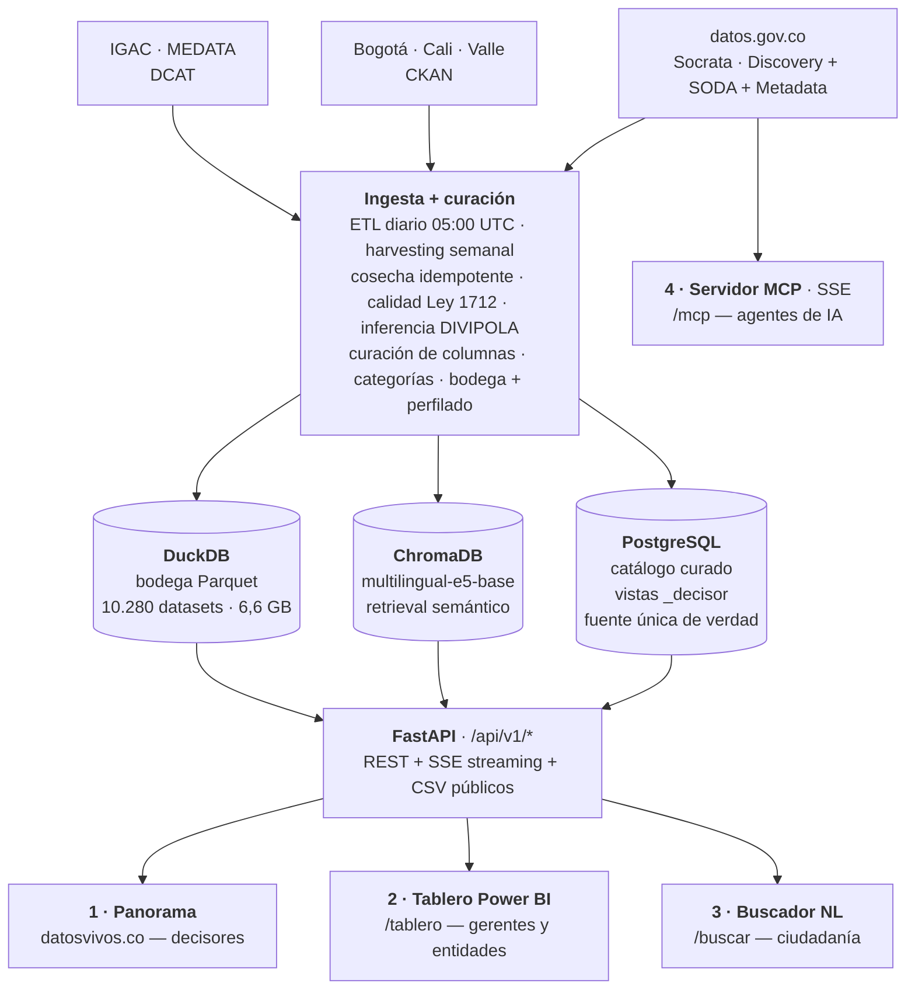

# DatosVivos — el panorama de los datos abiertos de Colombia

**El panorama de los datos abiertos de Colombia.**

> **Concurso Datos al Ecosistema 2026: IA para Colombia** (MinTIC)
> **Equipo 93 · Reto de Innovación y Tecnología (Reto 7, id 102) · Nivel Avanzado**
> Equipo GIT TIC — **Agencia Nacional de Infraestructura (ANI)**
>
> 🔴 **En producción:** https://datosvivos.co — cifras en vivo, actualización diaria automática.

DatosVivos integra en un solo catálogo consultable los **25.424 datasets** públicos de
Colombia (corte 2026-07-27; se actualiza a diario) y los entrega en **cuatro puertas,
una por audiencia**:

| Funcionalidad | Para quién | Dónde |
|---|---|---|
| **Panorama general** — cifras en vivo del ecosistema (frescura, sectores, territorio) | Tomadores de decisiones, prensa, ciudadanía | [datosvivos.co](https://datosvivos.co) |
| **Tablero por entidad** — detalle interactivo por sector, entidad y territorio | Gerentes sectoriales y entidades publicadoras | [/tablero](https://datosvivos.co/tablero) |
| **Buscador ciudadano** — preguntas en lenguaje natural, cifra verificada + fuente | Cualquier persona, sin barrera técnica | [/buscar](https://datosvivos.co/buscar) |
| **Servidor MCP** — el motor expuesto como herramientas para agentes de IA | Desarrolladores y agentes (Claude, OpenAI, etc.) | [/mcp](https://datosvivos.co/mcp) |

Todo con **modo de accesibilidad**: entrada por voz, narración de resultados y alto
contraste (Ley 1618 de 2013).

---

## Problema abordado

Colombia publica más de 25.000 datasets abiertos, pero **nadie tiene el panorama**:
una entidad no sabe cuántos datasets tiene publicados ni cuántos actualizados; un
gerente sectorial con N entidades adscritas no puede hacer control; el propio MinTIC
carece de una vista consolidada (los portales federados viven separados); y el
ciudadano que quiere una cifra necesita saber de APIs y SQL. **Si no conocemos, no
podemos medir — y si no medimos, no podemos mejorar.**

## Justificación (valor público)

El dato bien gobernado es infraestructura. Al corte del 2026-07-27, **el 71 % del
catálogo está desactualizado frente a la frecuencia que su propia entidad declaró** —
un incumplimiento invisible hasta ahora porque no existía la herramienta que lo
mostrara. DatosVivos convierte ese punto ciego en un indicador gestionable por
entidad, sector y territorio, y elimina la barrera técnica para consultar el dato
público. Se alinea con las Hojas de Ruta de Datos Abiertos Estratégicos y fortalece la
apropiación ciudadana del ecosistema digital (objetivo del Reto 7).

## Cantidad de datasets utilizados

**25.424 datasets** de **1.421 entidades** (corte 2026-07-27 — el catálogo se
re-ingesta automáticamente a diario, las cifras varían). Nivel Avanzado: integración
masiva de fuentes heterogéneas, no un análisis de dataset único.

El uso ocurre en tres capas, y conviene distinguirlas:

| Capa | Cuántos | Qué significa |
|---|---|---|
| **Catálogo indexado** | **25.424** | Todos están catalogados, clasificados y en el índice semántico: cualquiera es consultable en lenguaje natural |
| **Bodega local en Parquet** | **10.280** (6,6 GB) | Todos los tabulares viables tienen copia local; el buscador responde desde ellos en milisegundos |
| **Ejercitados en evaluación** | **48** | Los datasets que las 50 preguntas ciudadanas efectivamente eligieron y consultaron (lista completa abajo) |

**No estamos limitados a un subconjunto**: los 48 son el resultado de qué preguntó la
gente, no una lista blanca. La solución consulta cualquiera de los 25.424.

## Datasets utilizados de datos.gov.co

### Fuentes base del proceso de calidad

Estas son las fuentes que alimentan la curación, la clasificación y la inferencia
territorial de todo el catálogo:

| # | Fuente | Qué aporta |
|---|---|---|
| 1 | **DIVIPOLA — Codificación de municipios** ([`gdxc-w37w`](https://www.datos.gov.co/d/gdxc-w37w), DANE) | Referencia canónica territorial: 1.122 municipios + 32 departamentos + Bogotá D.C. Es la columna vertebral de la inferencia geográfica y del mapa (`ai_engine/geo_resolver_data.py`) |
| 2 | **Metadatos de jurisdicción de entidad** | Geolocalizan a las 1.421 entidades publicadoras y propagan territorio a sus datasets |
| 3 | **Catálogo Socrata datos.gov.co** (12.212) | Discovery API + SODA + Metadata API; cosecha diaria e idempotente |
| 4 | **Catálogo DCAT IGAC / Colombia en Mapas** (6.714) | Recursos geográficos del geoportal nacional |
| 5 | **Catálogo CKAN Datos Abiertos Bogotá** (4.333) | Portal territorial con más volumen |
| 6 | **Catálogo CKAN Datos Abiertos Cali** (1.236) | Portal territorial |
| 7 | **Catálogo CKAN Datos Abiertos Valle del Cauca** (106) | Portal territorial |
| 8 | **Catálogo DCAT MEDATA Medellín** (823) | Portal territorial con protocolo distinto |
| 9 | **Taxonomía temática consolidada** (~35 etiquetas → **25 canónicas**) | Vocabulario único de categorías, con 100 % de cobertura del catálogo útil (`scripts/classify_quality_flag.py`) |

### Los 48 datasets ejercitados en la evaluación ciudadana

50 preguntas ciudadanas reales, con la respuesta esperada escrita **antes** de correrlas,
ejecutadas en 5 ciclos contra producción. El motor eligió por su cuenta estos 48 datasets
(32 preguntas se respondieron desde la bodega Parquet y 9 en vivo contra la fuente).
Cada id enlaza a su ficha oficial en datos.gov.co para verificación directa.

<b>Ver los 48 datasets (id · nombre oficial)</b>

| # | Dataset | Nombre oficial |
|---|---|---|
| 1 | [`26bn-e42j`](https://www.datos.gov.co/d/26bn-e42j) | Créditos Otorgados. |
| 2 | [`28vu-5tx7`](https://www.datos.gov.co/d/28vu-5tx7) | CERTIFICACIÓN DE LA FORMACIÓN PROFESIONAL INTEGRAL |
| 3 | [`2uuh-awp9`](https://www.datos.gov.co/d/2uuh-awp9) | Comparendos - Control y Regulación Barranquilla |
| 4 | [`37hf-6yc2`](https://www.datos.gov.co/d/37hf-6yc2) | Contratacion Emserchia E.S.P. |
| 5 | [`49da-69ff`](https://www.datos.gov.co/d/49da-69ff) | Viviendas Construidas En Macroproyectos |
| 6 | [`52tq-ag6c`](https://www.datos.gov.co/d/52tq-ag6c) | Actividad Jurídica Nacional en Procesos Judiciales - ANDJE |
| 7 | [`5wck-szir`](https://www.datos.gov.co/d/5wck-szir) | MEN_MATRICULA_ESTADISTICA_ES |
| 8 | [`6jmc-vaxk`](https://www.datos.gov.co/d/6jmc-vaxk) | VEHICULOS INVOLUCRADOS EN UN ACCIDENTE DE TRANSITO LEY 2251-2022 |
| 9 | [`72sg-cybi`](https://www.datos.gov.co/d/72sg-cybi) | Reporte Lesiones Personales y en Accidente de Tránsito Policía Nacional |
| 10 | [`7b2d-zmwd`](https://www.datos.gov.co/d/7b2d-zmwd) | Residuos sólidos Empresa de Aseo - parte 2 - Residuos sólidos dispuestos en el relleno sanitario |
| 11 | [`7ffd-kpmz`](https://www.datos.gov.co/d/7ffd-kpmz) | Registro estadístico de las peticiones, quejas, reclamos y sugerencias |
| 12 | [`7i66-rps2`](https://www.datos.gov.co/d/7i66-rps2) | Estado de Vías |
| 13 | [`7wm8-w5ad`](https://www.datos.gov.co/d/7wm8-w5ad) | Extranjeros No Residentes |
| 14 | [`8u7u-645t`](https://www.datos.gov.co/d/8u7u-645t) | Consolidado de Cobertura Anual Vacunación en los municipios de Antioquia desde 1980 |
| 15 | [`9vha-vh9n`](https://www.datos.gov.co/d/9vha-vh9n) | Reporte Hurto por Modalidades Policía Nacional |
| 16 | [`a3jg-j674`](https://www.datos.gov.co/d/a3jg-j674) | Estudiantes Matriculados y Graduados CEFIT |
| 17 | [`a4bc-a9tq`](https://www.datos.gov.co/d/a4bc-a9tq) | REPORTE DE EVENTOS POR DESASTRES NATURALES Y ANTRÓPICOS (Histórico) |
| 18 | [`actn-47cb`](https://www.datos.gov.co/d/actn-47cb) | Directorio de funcionarios de la Procuraduría General de la Nación |
| 19 | [`aj2e-7jwg`](https://www.datos.gov.co/d/aj2e-7jwg) | Parque Automotor matriculados en el municipio de Fusagasugá |
| 20 | [`axk9-g2nh`](https://www.datos.gov.co/d/axk9-g2nh) | Tasas de interés de captación y operaciones del mercado monetario. |
| 21 | [`br9a-gygu`](https://www.datos.gov.co/d/br9a-gygu) | Ejecución Financiera de Regalías |
| 22 | [`c698-wqig`](https://www.datos.gov.co/d/c698-wqig) | Información Costo unitario de tarifas de energía CHEC |
| 23 | [`d3ft-wu2b`](https://www.datos.gov.co/d/d3ft-wu2b) | Calidad del agua del Rio Cauca |
| 24 | [`d4fr-sbn2`](https://www.datos.gov.co/d/d4fr-sbn2) | Reporte Hurto por Modalidades Policía Nacional |
| 25 | [`d4t4-daja`](https://www.datos.gov.co/d/d4t4-daja) | Tarifas de acueducto |
| 26 | `du92-6y56` | Flota Vinculada del SITP — *retirado del portal después del ciclo* |
| 27 | [`fky2-9rg4`](https://www.datos.gov.co/d/fky2-9rg4) | Subsidios Mejoramientos Programas CMC-MCY |
| 28 | [`fvq4-wwtz`](https://www.datos.gov.co/d/fvq4-wwtz) | Cantidad de empleos y tipos de planta por entidad |
| 29 | [`h2yr-zfb2`](https://www.datos.gov.co/d/h2yr-zfb2) | Subsidios De Vivienda Asignados |
| 30 | [`hp9r-jxuu`](https://www.datos.gov.co/d/hp9r-jxuu) | Catálogo Nacional de Estaciones del IDEAM |
| 31 | [`i7cb-raxc`](https://www.datos.gov.co/d/i7cb-raxc) | CÓDIGO ÚNICO DE MEDICAMENTOS VIGENTES |
| 32 | [`i9yn-r5bf`](https://www.datos.gov.co/d/i9yn-r5bf) | Ejecución de presupuesto de gasto por dependencia vigencia Palmira 2010 |
| 33 | [`ik3u-sdxz`](https://www.datos.gov.co/d/ik3u-sdxz) | IPS contratadas por Capresoca EPS |
| 34 | [`j3e8-4hke`](https://www.datos.gov.co/d/j3e8-4hke) | Estadistica de Pensionados Fonprecon - Formato 205 |
| 35 | [`k5bd-cym5`](https://www.datos.gov.co/d/k5bd-cym5) | OPORTUNIDAD EN ASIGNACIÓN DE CITAS DE MEDICINA ESPECIALIZADA DE LA E.S.E HUS |
| 36 | [`k7xp-z2d2`](https://www.datos.gov.co/d/k7xp-z2d2) | Oferta de Trámites, Otros Procedimientos Administrativos (OPA) y Consultas de Acceso a Información Pública |
| 37 | [`kekd-7v7h`](https://www.datos.gov.co/d/kekd-7v7h) | Calidad del Aire en Colombia (Promedio Anual) |
| 38 | [`m8fd-ahd9`](https://www.datos.gov.co/d/m8fd-ahd9) | HOMICIDIO |
| 39 | [`mjt9-2zwc`](https://www.datos.gov.co/d/mjt9-2zwc) | Población Privada de la Libertad por Nivel Académico, Sexo y Situación Jurídica en Establecimientos de Reclusión |
| 40 | [`mv2e-prx5`](https://www.datos.gov.co/d/mv2e-prx5) | Divipole Elecciones Territoritoriales 2023 con georreferenciación |
| 41 | [`nb3d-v3n7`](https://www.datos.gov.co/d/nb3d-v3n7) | Establecimientos - Agencias - Sucursales |
| 42 | [`qpf2-j35h`](https://www.datos.gov.co/d/qpf2-j35h) | REPORTE DE ESTUDIANTES BENEFICIADOS POR EL PROGRAMA DE ALIMENTACIÓN ESCOLAR |
| 43 | [`s3n2-sqjp`](https://www.datos.gov.co/d/s3n2-sqjp) | ESTABLECIMIENTOS IMPORTADORES CERTIFICADOS EN CCAA DE DISPOSITIVOS MÉDICOS Y EQUIPOS BIOMÉDICOS |
| 44 | [`sras-4t5p`](https://www.datos.gov.co/d/sras-4t5p) | MEN_ESTADISTICAS_EN_EDUCACION_EN_PREESCOLAR, BÁSICA Y MEDIA_POR_ETC |
| 45 | [`u2wk-tfe3`](https://www.datos.gov.co/d/u2wk-tfe3) | Saldo de las captaciones y colocaciones por municipios |
| 46 | [`u8vy-4dkb`](https://www.datos.gov.co/d/u8vy-4dkb) | Subsidios de Vivienda de la Caja Promotora de Vivienda Militar y de Policía |
| 47 | [`ucrd-5yjt`](https://www.datos.gov.co/d/ucrd-5yjt) | Iglesias |
| 48 | [`y399-rzwf`](https://www.datos.gov.co/d/y399-rzwf) | Connacionales inscritos en el Registro Ciudadano en Línea |

*Un dato revelador: `du92-6y56` respondía durante la evaluación y hoy ya no existe en el
portal. Es exactamente el tipo de volatilidad que el semáforo de frescura hace visible.*

### Datasets de demostración

- [`emd6-ef7x`](https://www.datos.gov.co/d/emd6-ef7x) — **Establecimientos educativos**:
  la consulta de referencia del buscador ("¿cuántos colegios públicos hay en Boyacá?" →
  *1.721 colegios oficiales de 2.184*, con filtro `SECTOR = 'OFICIAL'` y total sin filtrar).
- [`qpq9-e4ne`](https://www.datos.gov.co/d/qpq9-e4ne) — ejemplo de **cruce entre datasets**
  documentado en [datosvivos.co/mcp](https://datosvivos.co/mcp).

## Datasets utilizados externos

Portales integrados por harvesting directo, con atribución al portal de origen:

| Portal | Datasets | Protocolo |
|---|---|---|
| **IGAC / Colombia en Mapas** | 6.714 | DCAT |
| **Datos Abiertos Bogotá** | 4.333 | CKAN |
| **Datos Abiertos Cali** | 1.236 | CKAN |
| **MEDATA Medellín** | 823 | DCAT |
| **Datos Abiertos Valle del Cauca** | 106 | CKAN |

Con los 12.212 de datos.gov.co suman exactamente los **25.424** del catálogo
(verificable en vivo en [`/api/v1/stats/panorama`](https://datosvivos.co/api/v1/stats/panorama)).

## Variables seleccionadas

**29 variables curadas por dataset** en la vista `v_dataset_status_decisor` y **14 por
entidad** en `v_entity_summary_decisor` (`db/migrations/021_dashboard_decisor.sql`). Son
la fuente única: el panorama web, el tablero Power BI, los CSV públicos y el buscador
leen las mismas vistas, así que las cuatro puertas no pueden desalinearse entre sí.

<b>Las 29 variables de <code>v_dataset_status_decisor</code></b>

| Grupo | Variables |
|---|---|
| **Identidad** (5) | `dataset_id`, `dataset_name`, `entity_id`, `entity_name`, `entity_abbrev` |
| **Catalogación** (5) | `category`, `sector`, `jurisdiccion_nivel`, `cobertura_geografica`, `provenance` |
| **Semáforo de frescura** (5) | `rows_updated_at`, `update_frequency`, `frequency_days`, `days_since_update`, `status` |
| **Uso** (5) | `row_count`, `page_views_total`, `page_views_last_week`, `page_views_last_month`, `download_count` |
| **Fechas de catálogo** (2) | `metadata_updated_at`, `publication_date` |
| **Señales sociales** (2) | `number_of_comments`, `total_times_rated` — el `NULL` se conserva: *sin interacción* es una señal real, no un vacío que haya que tapar |
| **Calidad y acceso** (4) | `quality_flag`, `es_federado`, `acceso_datos` (`directo` / `requiere_herramienta` / `solo_metadatos`), `license_id` |
| **Enlace público** (1) | `socrata_url` |

`status` no es declarativo: se calcula comparando la última actualización real contra la
frecuencia que la propia entidad prometió (`compute_status`).

<b>Las 14 variables de <code>v_entity_summary_decisor</code></b>

| Grupo | Variables |
|---|---|
| **Identidad** (3) | `entity_id`, `entity_name`, `entity_abbrev` |
| **Volumen** (3) | `n_datasets`, `n_datasets_directos`, `n_datasets_federados` |
| **Telemetría ciudadana** (3) | `n_queries_30d`, `n_queries_total`, `last_access_at` — cero consultas es lectura honesta de adopción |
| **Semáforo por entidad** (4) | `datasets_verdes`, `datasets_amarillos`, `datasets_rojos`, `datasets_sin_fecha` |
| **Cumplimiento** (1) | `pct_verdes` — el KPI que un gerente puede gestionar directamente |

### Curación semántica por columna — lo que habilita el NL2SQL

Cada columna de cada dataset queda anotada en `dataset_columns_curated`
(`db/migrations/004_dataset_columns_curated.sql`) con tres atributos:

- `semantic_type`: `geo` · `fecha` · `metrica` · `dimension` · `exclude`
- `semantic_subtype`: `code`/`name`/`coord` · `year`/`date`/`period` ·
  `count`/`currency`/`rate`/`generic` · `demographic`/`administrative`/`educational`/`status`
- `confidence`: `high` (match unívoco por nombre canónico) · `medium` (keywords +
  tipo consistente) · `low` (solo tipo de dato)

Esa anotación es lo que permite que el motor sepa qué columna sumar, cuál agrupar y cuál
ignorar — y es lo único que el LLM llega a ver del dataset.

### ~297.000 valores filtrables reales

La bodega se perfila sola (`dataset_filter_values`, `scripts/profile_filter_values.py`):
para cada dataset se extraen los valores que **existen de verdad** en sus columnas
categóricas y sus años. La IA construye filtros **eligiendo** entre esos valores
("públicos" → `SECTOR = 'OFICIAL'`), nunca escribiendo SQL libre.

## Tipo de análisis

- **Descriptivo del ecosistema**: panorama nacional en vivo (composición, frescura,
  acceso, sectores, territorio, portales) + tablero exploratorio Power BI.
- **IA generativa aplicada (agente de servicios públicos)**: consultas ciudadanas en
  lenguaje natural resueltas con **NL2SQL / Text-to-SQL verificado** sobre los datos
  reales; clasificación automática de calidad; inferencia territorial.

## Modelo utilizado

Organizado por nivel del producto (nivel avanzado del TDR):

- **En los tableros** — IA para la **depuración, consolidación y definición de casos de
  calidad de datos**: clasificación de reportes administrativos (Ley 1712), curación de
  columnas con LLM + heurísticas, inferencia territorial DIVIPOLA, guardas anti-basura,
  consolidación de 6 portales con 3 protocolos.
- **En el buscador** — **motor NL2SQL generativo con verificación determinista de 3
  capas** (genera con LLM viendo solo columnas curadas reales; verifica con código
  antes de ejecutar; repara o rehúsa): embeddings `multilingual-e5` + ChromaDB para
  retrieval semántico **en ambos caminos** (el estructurado re-rankea sus candidatos
  con el mismo índice: el chip filtra, el embedding ordena), clasificador de
  intención, 6 TIPOs de respuesta (conteo, **suma de montos**, comparación, ranking,
  tendencia, mapa), narrativa anti-alucinación (cero cifras inventadas) y **MCP
  server** que expone las herramientas a cualquier agente de IA.
- Backend LLM conectable: **producción con la API de Claude (Haiku)** desde 2026-07-11 — interpretación NL en ~1.5 s (antes 31-45 s con modelo local); `LLM_BACKEND=ollama` queda para réplicas sin API key.

## Arquitectura

### De las fuentes a las cuatro puertas

**Despliegue**: cinco servicios en Docker Compose (`mcp-server`, `postgres`, `api`, `web`,
`nginx`) sobre infraestructura del Estado, con imagen horneada y reconstrucción
reproducible. El servidor MCP expone **cuatro herramientas** (`search_datasets`,
`get_metadata`, `query_data`, `cross_datasets`) por transporte SSE.

### El motor NL2SQL: generar no basta — hay que verificar

| Paso | Qué pasa | Dónde vive |
|---|---|---|
| **1 · Entender y encontrar** | Clasificador de intención + retrieval semántico (embeddings `multilingual-e5` sobre ChromaDB, umbral 0.815) recuperan el dataset pertinente entre 25 mil y cargan **solo sus columnas curadas reales** | `ai_engine/intent_classifier.py`, `vector_index.py`, `curated_columns.py` |
| **2 · Generar** | Claude Haiku (~1,5 s) escribe la consulta viendo únicamente esas columnas. Nunca ve el esquema completo ni inventa nombres | `ai_engine/query_generator.py` |
| **3 · Verificar (código, no IA)** | Tres capas deterministas: ¿las columnas existen? ¿las funciones son válidas? ¿es solo lectura? Más una prueba de ejecución `LIMIT 0` contra la fuente | `ai_engine/soql_verifier.py` |
| **4 · Ejecutar y contrastar** | Corre sobre la bodega Parquet (milisegundos) o sobre el dato vivo si la fuente cambió. Cada cifra de la narrativa se contrasta contra las filas reales; lo que no cuadra **se censura** | `duckdb_executor.py`, `stats_computer.py`, `analyzer.py` |

Si la consulta no verifica, entra un **ciclo de reparación dirigida** (tope de 4 intentos);
si persiste, el sistema **rehúsa explícitamente** en vez de responder mal. El camino de
chips no necesita LLM en absoluto: usa plantillas deterministas por TIPO (`Cuántos`,
`Total`, `Comparar`, `Ranking`, `Tendencia`, `Mapa`) y el embedding solo re-rankea.

**Bodega o dato vivo** — la decisión es automática (`api/routes/chips.py`): se usa la copia
local solo si el snapshot sigue alineado con la fecha de actualización de la fuente; si la
fuente cambió, o si el TIPO es `Mapa` (necesita códigos DIVIPOLA que solo produce el camino
curado), cae al dato vivo. Ante cualquier error, degrada a vivo en silencio.

### Modelo de datos — una vista curada como fuente única

| Objeto | Qué es |
|---|---|
| `datasets` (42 columnas) | Una fila por dataset del catálogo integrado; carga por upsert idempotente (cero duplicados de clave, auditado) |
| `v_dataset_status_decisor` (29) | La vista analítica: identidad, semáforo, uso, acceso, territorio y calidad |
| `v_entity_summary_decisor` (14) | El agregado por entidad con su `pct_verdes` gestionable |
| `dataset_columns_curated` | La anotación semántica por columna que habilita el NL2SQL |
| `dataset_filter_values` (~297k) | Los valores filtrables reales perfilados desde la bodega |
| Bodega Parquet (10.280) | Copia local de todos los tabulares viables, mantenida por una regla diaria de cola |

## Metodología (CRISP-ML(Q))

| Fase | Qué se hizo |
|---|---|
| **1 · Entender** | El dolor del decisor sin panorama; 6 portales y 3 protocolos (Socrata, CKAN, DCAT) mapeados como fuentes |
| **2 · Preparar** | ETL diario con upsert idempotente, clasificación Ley 1712, curación de columnas, inferencia territorial DIVIPOLA, guardas anti-basura y bodega local |
| **3 · Modelar** | NL2SQL generativo + verificación de 3 capas; embeddings e5 + ChromaDB; clasificador de intención con 6 tipos de respuesta |
| **4 · Evaluar** | Golden sets técnicos + ciclo ciudadano de 50 preguntas pre-registradas (ver abajo) |
| **5 · Desplegar** | Producción en datosvivos.co con Docker Compose reproducible e imagen horneada |
| **6 · Monitorear** | La calidad deriva del catálogo vivo: reindexado nocturno, re-clasificación continua y telemetría anónima de lo consultado |

**La adaptación central**: aquí no se entrena y se congela un modelo. **Cada consulta vive
su propio ciclo** — generación (LLM) → verificación (código) → ejecución. El riesgo que se
gestiona no es el error estadístico de un modelo entrenado, sino la consulta
*plausible-pero-equivocada*; por eso la verificación es determinista y auditable.

## Evaluación y trazabilidad

El motor se prueba en dos frentes: uno técnico, con casos de referencia versionados, y uno
ciudadano, con preguntas reales cuya respuesta esperada se escribió **antes** de correrlas.

| Frente | Qué cubre | Último resultado |
|---|---|---|
| [`eval/golden_chips.yaml`](eval/golden_chips.yaml) | 18 casos `(dataset, tipo) → cifra` con rangos tolerantes al *drift* de la fuente | **18/18** |
| [`eval/golden_queries.yaml`](eval/golden_queries.yaml) | 38 casos NL→SoQL, incluida la detección de cifras falsas | **38/38**, cero falsos verificados |
| [`eval/ciudadano/preguntas_50.yaml`](eval/ciudadano/preguntas_50.yaml) | 50 preguntas ciudadanas, 5 ciclos contra producción | 48 datasets ejercitados; los fallos se volvieron mejoras estructurales |
| [`tests/`](tests/) | 40 archivos de prueba: verificador, validador anti-alucinación, reparación, inferencia territorial, cosecha, MCP y rutas de la API | — |

Reproducibles con `python eval/run_eval_chips.py` y `python eval/run_eval_queries.py`. Los
patrones que fallaron produjeron cambios concretos y rastreables: re-ranking semántico,
TIPO `Total` para montos, honestidad de lejanía y filtros de valor.

## Por qué Nivel Avanzado (con la letra del TDR)

| El TDR (Nivel Avanzado) exige | DatosVivos lo cumple con |
|---|---|
| **Agentes de IA para servicios públicos** que consulten y procesen datos abiertos automáticamente | El agente consulta, cruza y procesa el catálogo para responder solicitudes ciudadanas |
| **IA generativa** para asistentes y **sistemas conversacionales basados en datos abiertos** | Buscador en lenguaje natural con motor **NL2SQL / Text-to-SQL** generativo verificado |
| **Modelos de lenguaje** y **arquitecturas híbridas** | LLM + verificación determinista de 3 capas ("la IA razona, el motor verifica") + embeddings neuronales de retrieval |
| **Integración de grandes volúmenes de datos**, múltiples fuentes | **25.424 datasets** de 6 portales y 3 protocolos (Socrata, CKAN, DCAT) — muy por encima de los 3-10 conjuntos del nivel intermedio |
| **Datos estructurados y no estructurados** | Metadata estructurada + texto libre (títulos, descripciones) procesado con embeddings y clasificadores |
| Más variables que el nivel intermedio (10-20) | **29 variables curadas por dataset** en la vista analítica (sobre 42 columnas fuente) |
| **Automatización, escalabilidad y despliegue funcional** | Actualización diaria automática, arquitectura agnóstica del portal, **en producción** en datosvivos.co |
| IA **pertinente, aplicable, interpretable y con aporte real** (no superficial) | Cada componente de IA resuelve un problema concreto y es auditable: la verificación es código, la clasificación es reproducible, cada cifra cita su fuente |

## Resultados clave

1. **Integración única**: nadie más consolida los portales federados territoriales de
   Colombia en un catálogo comparable.
2. **El hallazgo**: 71 % del catálogo "en rojo" (desactualizado frente a su propia
   promesa de frecuencia). Solo 9 % al día.
3. **El segundo hallazgo — se usa mucho, se dialoga nada**: 11,05 millones de
   descargas acumuladas y 3,95 millones de vistas de página al mes, pero solo
   **68 de 25.424 datasets (0,3 %) tienen algún comentario ciudadano** — el canal
   formal de participación del portal está muerto. Visible en vivo en la home
   ("Cuánto se usan y cuánto se dialoga").
4. **Actualización diaria automática**: el panorama se cura solo (ETL nocturno +
   harvesting semanal + clasificación continua). Ninguna cifra del sitio está quemada.
5. **Cero cifras inventadas**: verificación determinista + citación de fuente en cada
   respuesta del buscador.
6. **Calidad medida, no declarada**: auditoría columna a columna contra la fuente
   Socrata — **17 de 18 columnas al 100 % de fidelidad al corte del 2026-05-29** (la
   restante, `description`, resultó falso positivo por orden de truncado/normalización);
   **~89 % de cobertura territorial** (datasets con jurisdicción DIVIPOLA resuelta,
   incluido el ámbito nacional: 22.734 de 25.424); **100 % de cobertura de categoría
   temática** (2.504 huecos cerrados con clasificación semántica + curación revisada;
   vocabulario consolidado de ~35 etiquetas redundantes a 25 canónicas).
7. **Bodega local en Parquet — completa**: **10.280 datasets** (6,6 GB comprimidos,
   todos los tabulares viables del catálogo) viven como copia local en la
   infraestructura y **el buscador responde desde ellos en milisegundos** cuando el
   snapshot está fresco; si la fuente cambió, cae al dato vivo. Una regla diaria de
   cola la mantiene sola, y los orígenes muertos (403/404) penalizan el ranking.
8. **Evaluación centrada en el ciudadano**: 50 preguntas reales con respuesta
   esperada escrita ANTES de correrlas ([`eval/ciudadano/`](eval/ciudadano/)),
   corridas en ciclos contra producción; los patrones detectados se convirtieron en
   mejoras estructurales (re-ranking semántico, TIPO Total para montos, honestidad
   de lejanía). Los 48 datasets que el motor eligió están listados arriba, con enlace
   a la ficha oficial de cada uno.
9. **Filtros de valor dentro del dataset** (ADR-024): la bodega se perfila sola
   (10.280 datasets → ~297k valores filtrables reales) y el ciudadano filtra
   eligiendo, nunca escribiendo — por chips, por su propia pregunta ("públicos" →
   `SECTOR=OFICIAL`, elegido por IA SOLO entre valores existentes) o por territorio
   (pregunta departamental recorta el dataset nacional). Con filtro se muestra
   también el total sin filtrar: "1.721 colegios oficiales de 2.184 en Boyacá".
10. **Diccionario ciudadano↔institucional**: **121 términos ciudadanos → 221
   equivalencias oficiales** curadas ("colegios"→"establecimientos educativos",
   "robos"→"hurto") cierran de forma determinista la brecha entre cómo pregunta la
   gente y cómo el Estado titula sus datos
   ([`ai_engine/vocabulario_ciudadano.py`](ai_engine/vocabulario_ciudadano.py)).

## Interpretación

La brecha del dato abierto colombiano no es de cantidad sino de **gobernanza y
acceso**: los datos existen, pero no se mantienen frescos y consultarlos exige
capacidades técnicas. Medir contra la promesa de cada entidad convierte la percepción
en indicador gestionable.

## Impacto potencial

| Actor | Qué le cambia |
|---|---|
| Entidad publicadora | Ve en segundos cuántos datasets tiene y cuántos al día |
| Gerente / cabeza de sector | Control consolidado de sus entidades adscritas |
| MinTIC / política pública | Panorama nacional medible para las Hojas de Ruta |
| Ciudadanía | Cifras verificables en lenguaje natural, sin barrera técnica |

Escalable: agregar un portal CKAN es configuración; el patrón aplica a cualquier país
con catálogos Socrata/CKAN/DCAT; el MCP server permite construir encima.

## Soberanía, seguridad y cumplimiento

DatosVivos corre en infraestructura del Estado y solo toca datos que ya son públicos. El
diseño protege a las personas y hace el sistema auditable de punta a punta.

| Pilar | Cómo se cumple |
|---|---|
| **Infraestructura del Estado** | El servicio corre en una VM pública bajo VPN estatal; los datos consultados son públicos por definición |
| **Sin datos personales** | Cero registro y cero rastreadores. La telemetría es agregada y anónima: mide **qué** se consulta, nunca **quién** |
| **Solo lectura** | El motor no puede escribir en ninguna fuente; la verificación de solo-lectura es una de las tres capas del pipeline |
| **Repositorio abierto y auditable** | Código, pruebas y evaluación son públicos y replicables con Docker |
| **Accesibilidad** | Ley 1618 de 2013 y WCAG 2.1 AA: entrada por voz, narración de resultados, alto contraste y escala tipográfica |
| **Registro oficial** | Uso n.º 1074 en herramientas.datos.gov.co (2026-07-13) como aporte formal al ecosistema |

**Limitación honesta**: el semáforo hereda la calidad de la frecuencia que cada entidad
declara. Eso también es un hallazgo — expone la calidad de la propia declaración.

## Solución en Producción (Demo en Vivo)

Para ver y probar la solución funcionando en tiempo real:

**Aplicación Web / Producción:** [https://datosvivos.co](https://datosvivos.co)
· [Tablero del decisor](https://datosvivos.co/tablero)
· [Buscador en lenguaje natural](https://datosvivos.co/buscar)
· [Servidor MCP para agentes de IA](https://datosvivos.co/mcp)

**Registro oficial de uso:** el proyecto está postulado en el portal de usos de
datos.gov.co como *"DatosVivos - El panorama de los datos abiertos de Colombia"*
(**Uso n.º 1074**, registrado el 2026-07-13 en
[herramientas.datos.gov.co/usos](https://herramientas.datos.gov.co/usos)).

**API pública de estadísticas (verificación en vivo):**
[`/api/v1/stats/panorama`](https://datosvivos.co/api/v1/stats/panorama) ·
[`/api/v1/dashboard/datasets_decisor.csv`](https://datosvivos.co/api/v1/dashboard/datasets_decisor.csv)

## Enlaces de acceso

Presentación del proyecto:

*   [Descargar archivo original (.PPTX)](recursos/presentacion_v5.pptx) — *Para abrir y editar en PowerPoint.*
*   [Ver presentación en línea (.PDF)](recursos/presentacion_v5.pdf) — *Abre el visor interactivo de GitHub o GitLab.*
*   [Descarga directa (.PDF)](recursos/presentacion_v5.pdf?raw=true&inline=false) — *Fuerza la descarga en ambas plataformas.*

## Documentación

Este README concentra la documentación del proyecto: problema, fuentes, datasets,
variables, modelo, **arquitectura**, **metodología**, **evaluación** y resultados. El
sistema de diseño vive en [docs/BRAND.md](docs/BRAND.md); la evaluación reproducible en
[`eval/`](eval/) (goldens + runners + las 50 preguntas del ciclo ciudadano); y la guía
para conectar agentes de IA en [datosvivos.co/mcp](https://datosvivos.co/mcp).

## Roadmap (trabajo futuro)

1. **Filtro por municipio dentro del dataset** — el recorte territorial (ADR-024 F4)
   cubre departamentos; extender el mismo patrón de verificación contra el Parquet a
   los 1.100+ municipios.
2. **Respuestas compuestas** — KPI + tendencia + desglose en una sola vista, y tasas
   per cápita cruzando con población.
3. **Filtros sobre federados en vivo** — hoy los filtros de valor aplican solo sobre
   la copia local (el perfil describe el Parquet); los federados consultados en vivo
   responden sin filtro, y lo dicen.

## Equipo

**GIT TIC — Agencia Nacional de Infraestructura (ANI)**: Hernán Darío Gutiérrez Casas
(líder estratégico) · Ileana Andrea Navarro Castrillón (líder de equipo y
comunicaciones) · Jhonatan Sneider Rico Pinto (líder técnico y de datos).

## Licencia

Código abierto para validación y reutilización en el marco del concurso. Los datos
consultados son públicos, publicados por sus entidades bajo las licencias declaradas
en cada portal.
